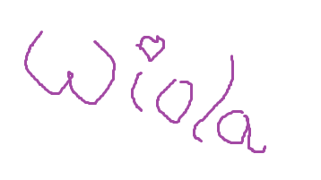

# Nagłówek 1
## Nagłówek 2
### Nagłowek 3
###### Nagłówek maksymalny - 6
*kursywa* 

**pogrubiewnie**

***pogrubienie i kursywa***

- lista
* lista
+ lista 

1. Lista uporządkowana
2. L. u.

`kod z tlem (inline code)` 

```
 kod w bloku 
```
[fb](facebook.com)




url - sciezka do pliku, najlepiej zeby byl w tym samym
folderze co plik readme

alt - tekst ktory sie wyswietla gdy obrazek nie moze
sie zaladowac (tekst alternatywny)

> cytat

> Baczens smierdzi,
> jest maly, i...
> ciagle pierdzi - Pierdziucjusz

---

***


